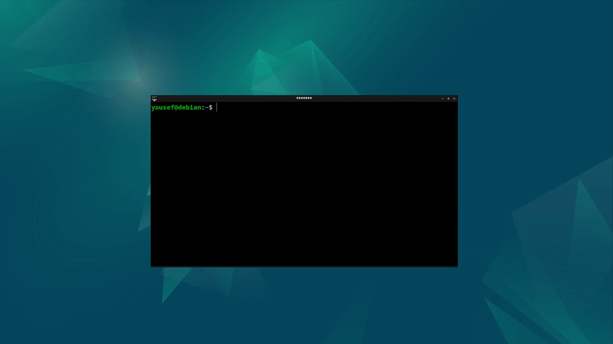

# OpenBox-Tiling

<br/>

<br/>
<br/>


<!-- {{{Table of Contents --> 

## Table of Contents

* [Table of Contents](#table-of-contents)
* [Introduction](#introduction)
* [Installation](#installation)
* [Usage](#usage)
* [Technical Details](#technical-details)
* [Project-DEMO](#project-demo)

<!-- }}} -->

<!-- {{{Introduction --> 
<br/>

## Introduction

This Project is a tiling script written in bash & xml that utilizes bash commands and built-in openbox actions to add tiling experience to openbox and enable custom-user configurations. All edge cases where considered and Efficient Algorithms had been used.

<!-- }}} -->

<!-- {{{Installation --> 
<br/>

## Installation

```bash
cd ~/.config/openbox
cp rc.xml rc-bk.xml
git clone https://github.com/yousef8192/OpenBox-Tiling.git
cd OpenBox-Tiling
cp * ~/.config/openbox
openbox --reconfigure
```

<br/>
<!-- }}} -->

<!-- {{{Usage --> 
<br/>

## Usage

* [ W + h ]       
    - TILE LEFT
<br/>
<br/>

* [ W + j ]       
    - TILE DOWN
<br/>
<br/>

* [ W + k ]       
    - TILE UP
<br/>
<br/>

* [ W + l ]       
    - TILE RIGHT
<br/>
<br/>

* [ W + \<CR> ]
    - TOGGLE FULLSCREEN

<!-- }}} -->

<!-- {{{Technical Details --> 

## Technical Details

* Language used is Bash & XML

* Design Approach is based on Functional Programming & Scripting

* Design is based on Vim Keybindings by default, however could be easily changed and customized

* Edge Rebounce Tiling is enabled by default

* Both windows with & without Decorations are supported

<br/>
<!-- }}} -->

<!-- {{{Project DEMO --> 

## Project-DEMO

<br/>

<br/><br/>

<!-- }}} -->


